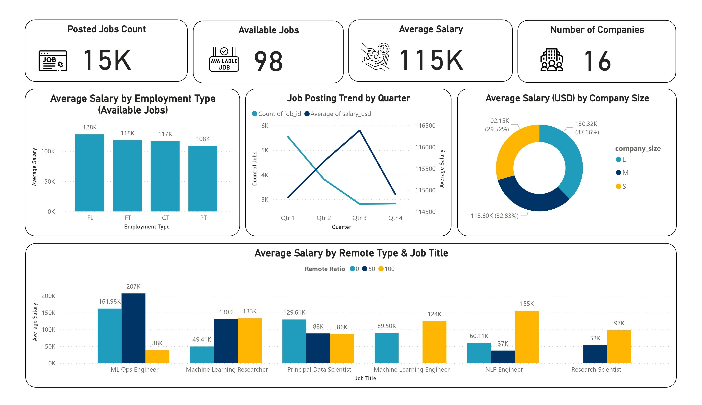

# 🌍 AI Job Market Insights (2025)

This project provides a comprehensive analysis of the global AI job market using a dataset sourced from Kaggle. By leveraging Python for data preprocessing and visualization, and Power BI for interactive dashboards, it explores salary distributions, remote work trends, top-paying roles, and hiring patterns by location and time.

---

## 📊 Project Highlights

- Cleaned and analyzed real-world AI job listings from around the globe.
- Compared salary trends across remote, hybrid, and onsite roles.
- Identified top-paying job titles in the AI field.
- Visualized global hiring distribution using Power BI maps.
- Tracked job posting trends over time using line and bar charts.

---

## 🗂️ Dataset

- **Source:** [Kaggle - Global AI Job Market and Salary Trends 2025](https://www.kaggle.com/datasets/bismasajjad/global-ai-job-market-and-salary-trends-2025)
- Contains fields such as job title, location, company location, salary in USD, remote ratio, and more.

---

## 🛠️ Tools & Technologies

- **Python:** Pandas, Matplotlib, Seaborn
- **Power BI:** Interactive dashboard visualizations
- **Jupyter Notebook:** Data exploration and cleaning

---

## 📌 Key Insights

- Remote roles generally offer higher average salaries than onsite or hybrid roles.
- Certain countries and job titles consistently offer the highest compensation.
- Job postings peaked during specific quarters, indicating market demand trends.

---

## 📸 Dashboard Preview

---

## 🚀 How to Use

1. Clone this repository.
2. Open the Jupyter notebook to view the data analysis.
3. Explore the Power BI `.pbix` file for interactive insights.

---

## 📬 Contact

Open to feedback, suggestions, or collaboration!  
Feel free to **fork** this repo or connect with me on [LinkedIn](https://www.linkedin.com/in/reham-mahmoud-rushdi/).

---
